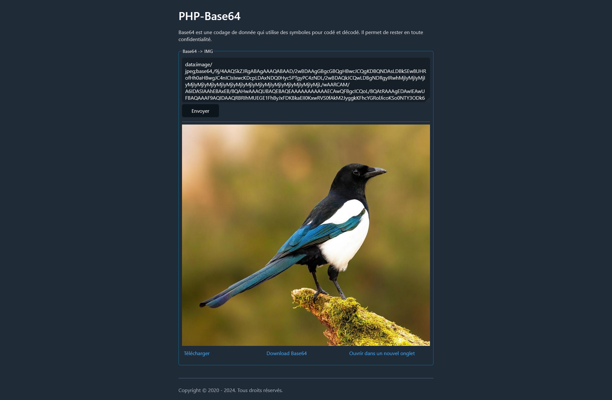

# php-base64

> [!NOTE]
> Other features may be added in the future.

## What is it?
It's a micro-site for converting images to base64 and vice versa.

## Installation

1. Clone the repository
```sh
git clone https://github.com/kerogs/php-base64.git
```

2. Host the repo

## Preview
